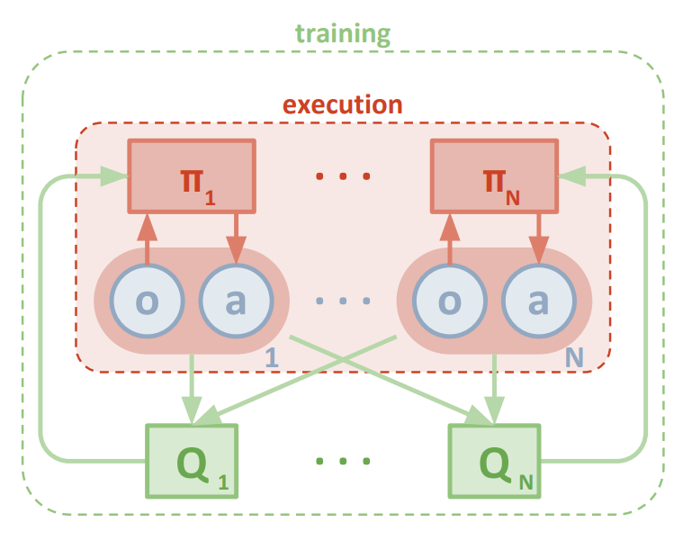
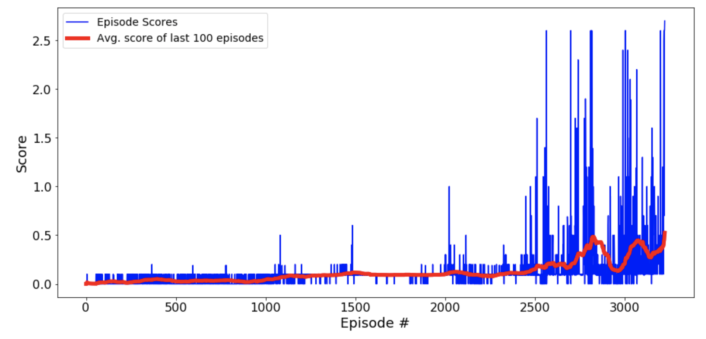

# Project 3 : Collaboration and Competition

## Project's goal

In this environment, two agents control rackets to bounce a ball over a net. If an agent hits the ball over the net, it receives a reward of +0.1.  If an agent lets a ball hit the ground or hits the ball out of bounds, it receives a reward of -0.01.  **Thus, the goal of each agent is to keep the ball in play.**

The task is episodic, and in order to solve the environment, **the agents must get an average score of +0.5 (over 100 consecutive episodes, after taking the maximum over both agents)**. Specifically,

- After each episode, we add up the rewards that each agent received (without discounting), to get a score for each agent. This yields 2 (potentially different) scores. We then take the maximum of these 2 scores.
- This yields a single **score** for each episode.

The environment is considered solved, when the average (over 100 episodes) of those **scores is at least +0.5.**


## Environment details

The environment is based on [Unity ML-agents](https://github.com/Unity-Technologies/ml-agents). The project environment provided by Udacity is similar to the [Tennis](https://github.com/Unity-Technologies/ml-agents/blob/master/docs/Learning-Environment-Examples.md#tennis) environment on the Unity ML-Agents GitHub page.

> The Unity Machine Learning Agents Toolkit (ML-Agents) is an open-source Unity plugin that enables games and simulations to serve as environments for training intelligent agents. Agents can be trained using reinforcement learning, imitation learning, neuroevolution, or other machine learning methods through a simple-to-use Python API. 

The observation space consists of 8 variables corresponding to the position and velocity of the ball and racket. Each agent receives its own, local observation.  Two continuous actions are available, corresponding to movement toward (or away from) the net, and jumping. 

- Set-up: Two-player game where agents control rackets to bounce ball over a net.
- Goal: The agents must bounce ball between one another while not dropping or sending ball out of bounds.
- Agents: The environment contains two agent linked to a single Brain named TennisBrain. After training you can attach another Brain named MyBrain to one of the agent to play against your trained model.
- Agent Reward Function (independent):
  - +0.1 To agent when hitting ball over net.
  - -0.1 To agent who let ball hit their ground, or hit ball out of bounds.
- Brains: One Brain with the following observation/action space.
- Vector Observation space: 8 variables corresponding to position and velocity of ball and racket.
  - In the Udacity provided environment, 3 observations are stacked (8 *3 = 24 variables) 
- Vector Action space: (Continuous) Size of 2, corresponding to movement toward net or away from net, and jumping.
- Visual Observations: None.
- Reset Parameters: One, corresponding to size of ball.
- Benchmark Mean Reward: 2.5
- Optional Imitation Learning scene: TennisIL.


## Agent Implementation

This project uses an *off-policy method* called **Multi Agent Deep Deterministic Policy Gradient (MADDPG)** algorithm.

### Background for Deep Deterministic Policy Gradient (DDPG)

MADDPG find its origins in an *off-policy method* called **Deep Deterministic Policy Gradient (DDPG)** and described in the paper [Continuous control with deep reinforcement learning](https://arxiv.org/abs/1509.02971). 

> We adapt the ideas underlying the success of Deep Q-Learning to the continuous action domain. We present an actor-critic, model-free algorithm based on the deterministic policy gradient that can operate over continuous action spaces. Using the same learning algorithm, network architecture and hyper-parameters, our algorithm robustly solves more than 20 simulated physics tasks, including classic problems such as cartpole swing-up, dexterous manipulation, legged locomotion and car driving. Our algorithm is able to find policies whose performance is competitive with those found by a planning algorithm with full access to the dynamics of the domain and its derivatives. We further demonstrate that for many of the tasks the algorithm can learn policies end-to-end: directly from raw pixel inputs.

Deep Deterministic Policy Gradient (DDPG) is an algorithm which concurrently learns a Q-function and a policy. It uses off-policy data and the Bellman equation to learn the Q-function, and uses the Q-function to learn the policy.

More details available on the Open AI's [Spinning Up](https://spinningup.openai.com/en/latest/algorithms/ddpg.html) website.


This algorithm screenshot is taken from the [DDPG algorithm from the Spinning Up website](https://spinningup.openai.com/en/latest/algorithms/ddpg.html)

### Multi Agent Deep Deterministic Policy Gradient (MADDPG)

For this project I have used a variant of DDPG called **Multi Agent Deep Deterministic Policy Gradient (MADDPG)** which is  described in the paper [Multi-Agent Actor-Critic for Mixed Cooperative-Competitive Environments](https://arxiv.org/abs/1706.02275)

> We explore deep reinforcement learning methods for multi-agent domains. We begin by analyzing the difficulty of traditional algorithms in the multi-agent case: Q-learning is challenged by an inherent non-stationarity of the environment, while policy gradient suffers from a variance that increases as the number of agents grows. We then present an adaptation of actor-critic methods that considers action policies of other agents and is able to successfully learn policies that require complex multi-agent coordination. Additionally, we introduce a training regimen utilizing an ensemble of policies for each agent that leads to more robust multi-agent policies. We show the strength of our approach compared to existing methods in cooperative as well as competitive scenarios, where agent populations are able to discover various physical and informational coordination strategies.

 (screenshot from the paper)


The main concept behind this algorithm is summarized in this illustration taken from the paper :

 (screenshot from the paper)

> we accomplish our goal by adopting the framework of centralized training with
decentralized execution. Thus, we allow the policies to use extra information to ease training, so
long as this information is not used at test time. It is unnatural to do this with Q-learning, as the Q
function generally cannot contain different information at training and test time. Thus, we propose
a simple extension of actor-critic policy gradient methods where the critic is augmented with extra
information about the policies of other agents.

In short, this means that during the training, the Critics networks have access to the states and actions information of both agents, while the Actors networks have only access to the information corresponding to their local agent.

### Code implementation

The code used here is derived from the "DDPG pidedal" tutorial from the [Deep Reinforcement Learning Nanodegree](https://www.udacity.com/course/deep-reinforcement-learning-nanodegree--nd893), and modified to implement the **Multi-Agent Actor Critic**  as discussed in the Multi-Agent Udacity tutorial lesson.

The code is written in [Python 3.6](https://www.python.org/downloads/release/python-360/) and is relying on [PyTorch 0.4.0](https://pytorch.org/docs/0.4.0/) framework.

The code consist of :

- `model.py` : Implement the **Actor** and the **Critic** classes.
    - The Actor and Critic classes each implement a *Target* and a *Local* Neural Networks used for the training.

- `maddpg_agent.py`: 
   - Implementation of the MADDPG alorithm. 
        - The `maddpg` is relying on the `ddpg` class
        - It instanciates DDPG Agents
        - It provides a helper function to save the models checkpoints
        - It provides the `step()` and `act()` methods
        - As the **Multi-Agent Actor Critic** `learn()` function slightly differs from the DDPG one, a `maddpg_learn()` method is provided here.
            - The `learn()` method updates the policy and value parameters using given batch of experience tuples.
                ```
                Q_targets = r + γ * critic_target(next_state, actor_target(next_state))
                where:
                    actor_target(states) -> action
                    critic_target(all_states, all_actions) -> Q-value
                ```  
            
    -  Implement of the **DDPG agent** and a **Replay Buffer memory** used by the DDPG agent.
        - The Actor's *Local* and *Target* neural networks, and the Critic's *Local* and *Target* neural networks are instanciated by the Agent's constructor
        - The `learn()` method is specific to DDPG and is not used in this project (I keep it for code later code reuse)
    
- `Tennis.ipynb` : This Jupyter notebooks allows to instanciate and train both agent. More in details it allows to :
  - Prepare the Unity environment and Import the necessary packages 
  - Check the Unity environment
  - Define a helper function to instanciate and train a MADDPG agent
  - Train an agent using MADDPG 
  - Plot the score results

### MADDPG results


Given the chosen architecture and parameters, our results are :



**These results meets the project's expectation as the agent is able to receive an average reward (over 100 episodes) of at least +0.5 in 2487 episodes** 


### Ideas for future work

As presented on [OpenAI](https://openai.com/)'s [Spinning Up](https://spinningup.openai.com/en/latest/index.html) website, the **Twin Delayed DDPG (TD3)** alorithm might be a good improvement for our Multi Agents environments.

See :[Twin Delayed DDPG (TD3)](https://spinningup.openai.com/en/latest/algorithms/td3.html)


> While DDPG can achieve great performance sometimes, it is frequently brittle with respect to hyperparameters and other kinds of tuning. A common failure mode for DDPG is that the learned Q-function begins to dramatically overestimate Q-values, which then leads to the policy breaking, because it exploits the errors in the Q-function. Twin Delayed DDPG (TD3) is an algorithm which addresses this issue by introducing three critical tricks:

> - Trick One: Clipped Double-Q Learning. TD3 learns two Q-functions instead of one (hence “twin”), and uses the smaller of the two Q-values to form the targets in the Bellman error loss functions.

> - Trick Two: “Delayed” Policy Updates. TD3 updates the policy (and target networks) less frequently than the Q-function. The paper recommends one policy update for every two Q-function updates.

> - Trick Three: Target Policy Smoothing. TD3 adds noise to the target action, to make it harder for the policy to exploit Q-function errors by smoothing out Q along changes in action.

> Together, these three tricks result in substantially improved performance over baseline DDPG


This algorithm screenshot is taken from the [Twin Delayed DDPG (TD3) from the Spinning Up website](https://spinningup.openai.com/en/latest/algorithms/td3.html)

More details in the paper : [Addressing Function Approximation Error in Actor-Critic Methods](https://arxiv.org/abs/1802.09477)

>  In value-based reinforcement learning methods such as deep Q-learning, function approximation errors are known to lead to overestimated value estimates and suboptimal policies. We show that this problem persists in an actor-critic setting and propose novel mechanisms to minimize its effects on both the actor and the critic. Our algorithm builds on Double Q-learning, by taking the minimum value between a pair of critics to limit overestimation. We draw the connection between target networks and overestimation bias, and suggest delaying policy updates to reduce per-update error and further improve performance. We evaluate our method on the suite of OpenAI gym tasks, outperforming the state of the art in every environment tested.


Second idea, to further improve our Multi-Agents project would be to implement [Prioritized experience replay](https://arxiv.org/abs/1511.05952)

> Experience replay lets online reinforcement learning agents remember and reuse experiences from the past. In prior work, experience transitions were uniformly sampled from a replay memory. However, this approach simply replays transitions at the same frequency that they were originally experienced, regardless of their significance. In this paper we develop a framework for prioritizing experience, so as to replay important transitions more frequently, and therefore learn more efficiently. We use prioritized experience replay in Deep Q-Networks (DQN), a reinforcement learning algorithm that achieved human-level performance across many Atari games. DQN with prioritized experience replay achieves a new state-of-the-art, outperforming DQN with uniform replay on 41 out of 49 games.


### Misc : Configuration used 

This agent has been trained on my "Deep Learning Dev Box", which is basically a Linux GPU Server, running Docker containers (using Nvidia Docker 2), serving Jupyter Lab notebooks which are accessed remotely via a web interface (or a ssh connection) : unfortunately this setup does not seem suitable to run Unity ML agent, with the GPU and providing a display for for the agent (See [Unity documentation](https://github.com/Unity-Technologies/ml-agents/blob/master/docs/Using-Docker.md) for more details). Thus the headless / no visualization version of the Unity environment was used.